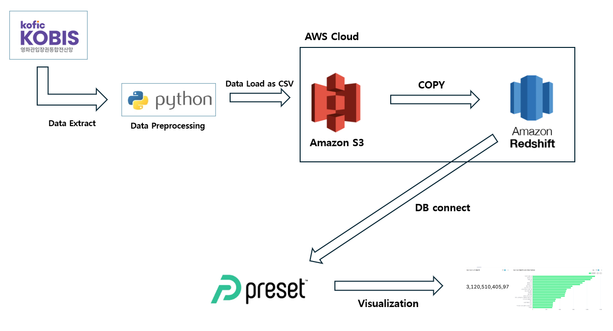
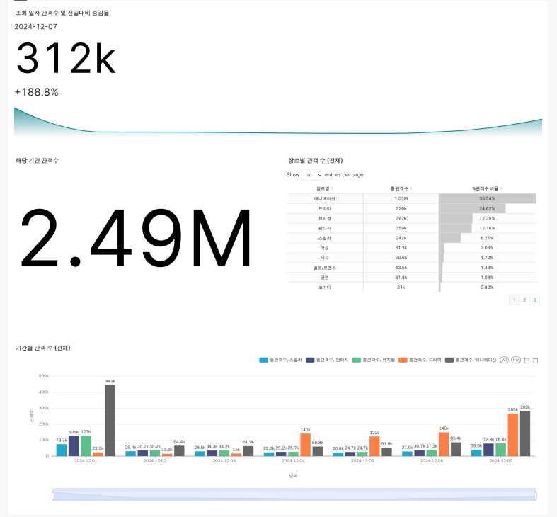

# **데이터 웨어하우스를 이용한 대시보드 구성 프로젝트**
- **프로젝트 진행 기간**: 2025.01.06 ~ 2025.01.09
- **역활**: 장르 (+기간) 별 데이터 수집 및 시각화
---
> ## 0. 보고서

- [프로젝트 2 보고서](https://flax-entree-f78.notion.site/1b6db7c679148072a708e985fbfb2294?p=1b6db7c67914814a944edf18fb8cea28&pm=c)

> ## 1. 프로젝트 개요
- 영화 산업은 문화와 경제에 큰 영향을 미치는 분야로, 관객의 선호도와 트렌드 분석이 중요함. 
- 최근 OTT 플랫폼의 확산과 장르 인기도 변화 등으로 시장의 복잡성이 증가하고 있음. 
- 이에 따라 데이터 기반 의사 결정의 중요성이 커지고 있어, 본 주제를 선정하게 되었음.
  
> ## 2. 활용 기술

- **데이터 소스**
    - [KOFIC 영화관 입장권 통합전산망 :: 일별 박스오피스](https://www.kobis.or.kr/kobis/business/stat/boxs/findDailyBoxOfficeList.do)
- **데이터 수집**
    - **일별 데이터**: Selenium
- **데이터 처리**
    - **xls에서 xlsx로 변환**: pywin32
    - **데이터 추출 및 저장**: Pandas
- **데이터 적재**
    - **DataLake :** AWS S3
    - **DataWarehouse :** AWS Redshift
- **데이터 시각화**
    - **Dashboard :** Preset
- **협업 Tools**
    - Github

> ## 3.데이터 흐름

- KOBIS에서 데이터를 수집을 하면 S3에 저장을 하고 RedShift의 Copy Command를 이용해 테이블에 적재
- Preset을 이용하여 Redshift에 있는 테이블을 시각화

> ###  4. **장르 (+기간) 별 대시보드**

> ### **src 폴더 구조**

|
Folder
|
Info
|
|----------|--------|
|
code
|
일별 데이터 수집/처리 및 Redshift 적재 코드.
|
|
data
|
수집된 데이터가 있는 .csv 파일들
|
|
config
|
RedShift 연결시 필요한 Parameter 수록. Parameter 값들은 실행시 추가 필요.
|
|
xls_files
|
Selenium를 통해 저장한 파일 저장 장소
|
|
xlsx_files
|
xls에서 xlsx로 변환된 파일 저장 장소
|
|
img
|
스크린 샷 저장 장소
|
