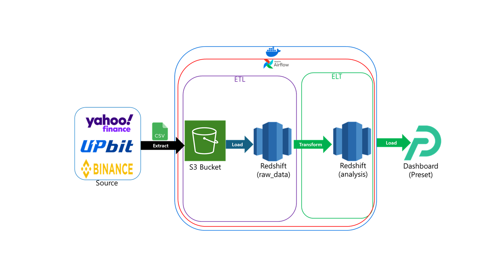
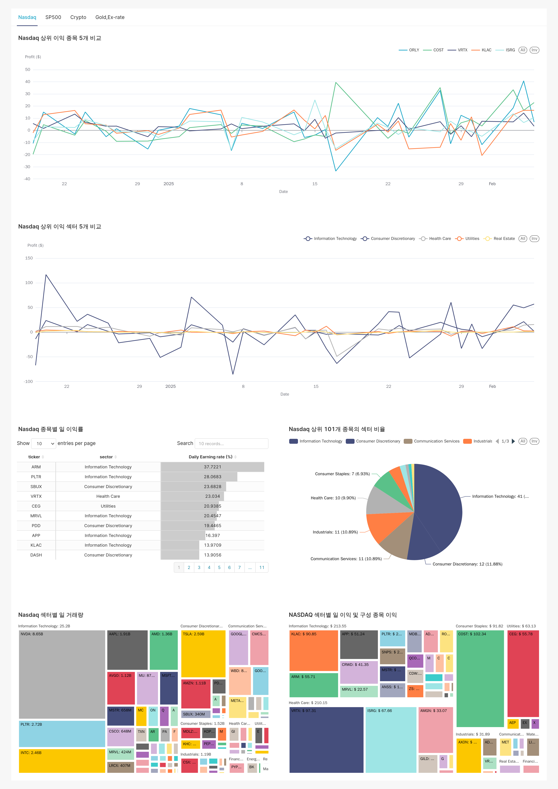

# 금융 데이터 분석 파이프 라인 자동화 및 시각화 프로젝트

- **프로젝트 진행 기간**: 2025.01.24 ~ 2025.02.06
- **역활**: NASDAQ 상위 100개 지수의 일별 데이터 수집 및 시각화

---
> ## 0. 프로젝트 보고서
- [프로젝트 3 보고서](https://flax-entree-f78.notion.site/1b6db7c679148072a708e985fbfb2294?p=1b6db7c6791481d4bec5e91e95e540c7&pm=c)

> ## 1. 기술적 목표

- 최신 금융 데이터 파이프라인 구축
- Airflow 기반 데이터 파이프라인 구축을 통한 자동화
- Redshift 및 S3를 활용한 데이터 저장 및 관리
- Preset 대시보드를 통한 직관적인 데이터 분석 환경 제공

> ## 2. 활용기술

- **데이터 수집**
    - **주식**: yfinance
- **데이터 처리**
    - **데이터 추출 및 저장**: Pandas
- **데이터 적재**
    - **DataLake :** AWS S3
    - **DataWarehouse :** AWS Redshift
- **데이터 파이프라인**
    - **ETL, ELT**: Apache Airflow
- **컨테이너**
    - **Docker**
- **데이터 시각화**
    - **Dashboard :** Preset
- **협업 Tools**
    - Github

> ## 3. 프로젝트 세부내용

> ### 프로젝트 전체 흐름

- 도커 컨테이너를 이용해 Airflow를 구동
- Airflow를 이용하여 Source에서 주기적으로 데이터를 수집해서 공용 S3 Bucket에 적재하고 수집한 내용을 Redshift의 raw data 스키마에 있는 테이블에 최신정보를 적재.
- raw_data 스키마에 있는 테이블을 기반으로 분석에 필요한 정보를 analysis 스키마에 있는 테이블에 적재를 하고 Preset 대시보드에 최신정보를 반영

> ### 대시보드 구성

- 대시보드 (전체)
    
    
    

> ## 4. 결과 및 개선점

> ### 프로젝트 성과

1. 다양한 금융 데이터의 통합 수집 및 자동화된 파이프라인 구축
2. 데이터가 최신 상태로 유지됨으로써 시각화 결과의 정확성 및 활용성 증가

> ### 향후 개선 방향

1. 에러 핸들링 및 모니터링 강화
    1. Github Action 및 Slack 연결을 통해 CI/CD 모니터링 및 에러 감지/처리 고도화
2. created_at, updated_at 등 데이터 리니지 관련 처리 추가
