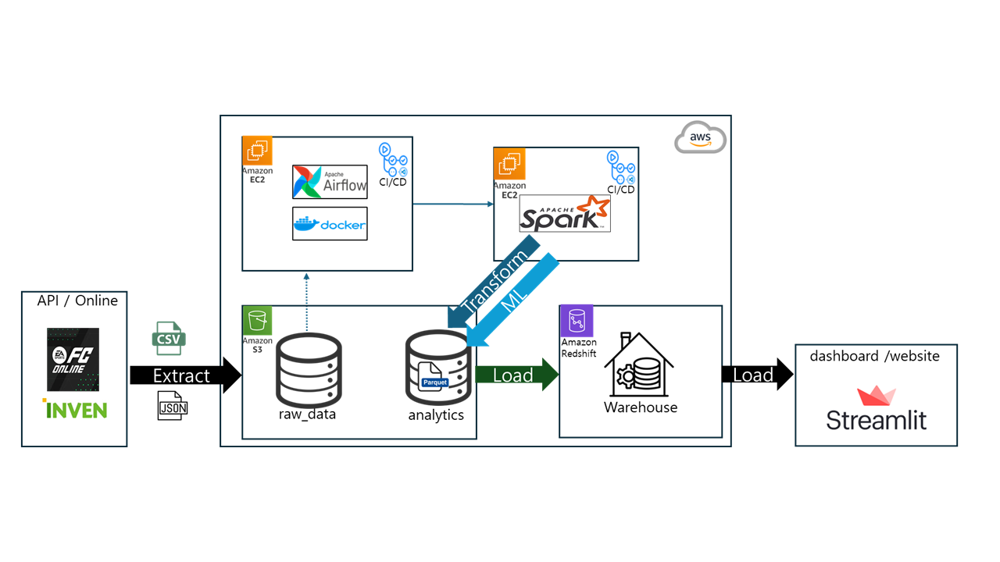

# FC ONLINE 데이터 분석 플랫폼 구축

- **프로젝트 진행 기간**: 2025.02.24 ~ 2025.03.19
- **역활**:
    - 플레이어 상위 1,000명 상세 매치 데이터 수집 및 처리
    - AWS 서버 관리 (EC2 내에 Airflow, Spark 설치 및 Redshift 관리)

---
> ## 0.프로젝트 보고서
- [최종 프로젝트 보고서](https://www.notion.so/1b6db7c679148072a708e985fbfb2294?p=1b6db7c6791481f0bd5cd9f4dfa98aa4&pm=c)

> ## 1. 기술적 목표

- 웹크롤링 통한 데이터 수집
- AWS S3에 데이터 적재 및 전처리
- Pyspark를 통한 데이터 처리
- SparkML을 활용한 감정분석 모델 개발
- Airflow를 통한 데이터 파이프라인 자동화
- Streamlit 기반 Dashboard 제작하여 데이터 시각화

> ## 2. 활용기술

- **데이터 소스**
    - [게이머 랭킹 데이터](https://fconline.nexon.com/datacenter/rank)
    - [메치 상세 정보](https://openapi.nexon.com/ko/game/fconline/?id=2)
    - [선수 리뷰 데이터](https://fconline.inven.co.kr/dataninfo/rate/)
- **데이터 수집**
    - **랭킹 & 선수 리뷰 데이터:** Selenium
    - **메치 상세 정보**: Rest-API
- **데이터 처리**
    - **데이터 추출 및 저장**: PySpark
- **데이터 파이프라인**
    - **ETL**: Airflow
    - **파이프라인 배포:** Docker
    - **CI/CD**: Github Action
- **데이터 적재**
    - **DataLake :** AWS S3
    - **DataWarehouse :** AWS Redshift
- **협업 Tools**
    - Github

> ## 3. 프로젝트 전체 흐름

- 넥슨 FC Online 공식  웹사이트에서 플레이어들의 랭킹을 수집 후,
- 상위 1,000명의 매치 세부 데이터를 API를 통해 수집.
- 매치 세부 데이터에서 선수 리스트를 추출, 각 선수들의 리뷰 데이터를 추출함.
- 플레이어들의 다양한 meta data 처리 및 선수의 리뷰 데이터 긍부정 판별을 하는 머신러닝 모델 학습을 Spark로 진행함.
- Redshift에 적재된 데이터를 기반으로 Streamlit 기반 대시보드로 시각화.
- Docker Container로 구성된 Airflow를 통해 Data Pipeline을 자동화.
---

> ## 대시보드 시연 영상

> #### Part1

> #### Part2

---

> ## 4. 결과 및 개선점

> ### 프로젝트 성과

1. 다양한 게임 데이터의 통합 수집 및 자동화된 파이프라인 구축
2. 데이터가 최신 상태로 유지됨으로써 시각화 결과의 정확성 및 활용성 증가

> ### 확장 가능성
- 리그 오브 레전드(LOL), NBA 2K, FIFA 시리즈 등의 다른 게임 데이터를 활용한 분석으로 주제 확장 가능

> ### 우수 프로젝트로 선정됨

